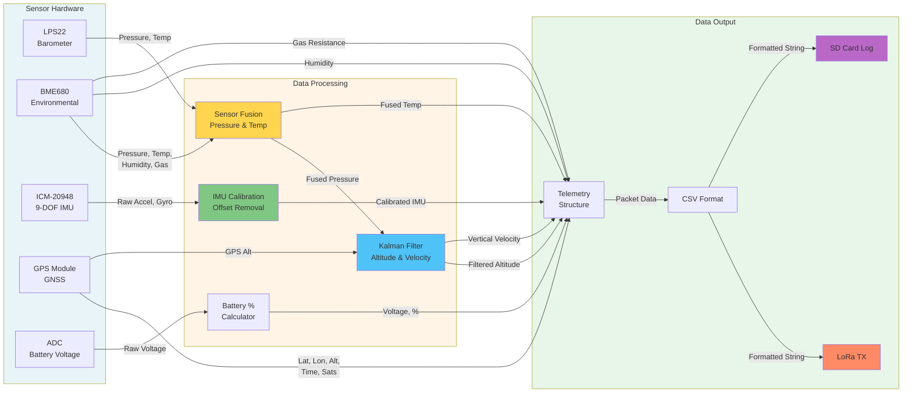
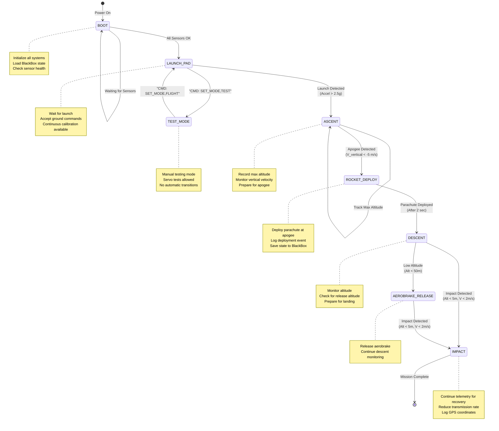
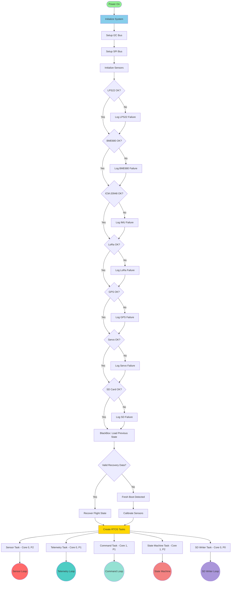

# CANSAT_ONBOARD_FINAL

- The CANSAT_ONBOARD_FINAL repository contains the complete flight software for the CanSat competition. This includes sensor integration, state management, telemetry transmission, command handling, data logging, and deployment mechanisms.
- Deployed on ESP32 microcontroller using FreeRTOS for real-time task management.
- Developed in C++ with modular architecture for Arduino IDE compatibility.

## Flows

### State diagram Flow (missing the SHT41)

---

### State Diagram (Syntax error)

---

### System Flowchart 

---

# CANSAT Flight Software Requirements Specification

## 1. Functional Requirements

### 1.1 State Management (REQ-FSM)
- **REQ-FSM-001**: System SHALL maintain 8 distinct flight states: BOOT, TEST_MODE, LAUNCH_PAD, ASCENT, ROCKET_DEPLOY, DESCENT, AEROBRAKE_RELEASE, IMPACT
- **REQ-FSM-002**: Current state SHALL be transmitted in every telemetry packet
- **REQ-FSM-003**: System SHALL recover correct state after processor reset using sensor data
- **REQ-FSM-004**: State transitions SHALL be logged with timestamp
- **REQ-FSM-005**: Invalid state transitions SHALL be prevented

### 1.2 Telemetry Requirements (REQ-TM)
- **REQ-TM-001**: Telemetry SHALL be transmitted at 1 Hz minimum
- **REQ-TM-002**: Telemetry packet SHALL follow CSV format specified in competition rules
- **REQ-TM-003**: Telemetry SHALL include all 16 required fields: TEAM_ID, TIME_STAMPING, PACKET_COUNT, ALTITUDE, PRESSURE, TEMP, VOLTAGE, GNSS_TIME, GNSS_LATITUDE, GNSS_LONGITUDE, GNSS_ALTITUDE, GNSS_SATS, ACCEL_DATA, GYRO_DATA, FLIGHT_STATE, OPTIONAL_DATA
- **REQ-TM-004**: Time resolution SHALL be 1 second or better
- **REQ-TM-005**: Timestamp SHALL NOT be affected by processor reset
- **REQ-TM-006**: Packet count SHALL persist across resets
- **REQ-TM-007**: Altitude SHALL be relative to ground with 0.1m resolution
- **REQ-TM-008**: Pressure SHALL be in Pascals with 1 Pa resolution
- **REQ-TM-009**: Temperature SHALL be in Celsius with 0.1°C resolution
- **REQ-TM-010**: Voltage SHALL be in Volts with 0.01V resolution
- **REQ-TM-011**: GNSS coordinates SHALL have 0.0001 degree resolution
- **REQ-TM-012**: Accelerometer data SHALL be in m/s²
- **REQ-TM-013**: Gyroscope data SHALL be in deg/s
- **REQ-TM-014**: Optional data SHALL include battery percentage and vertical speed

### 1.3 Sensor Requirements (REQ-SENS)
- **REQ-SENS-001**: System SHALL read LPS22 barometer at 10 Hz minimum
- **REQ-SENS-002**: System SHALL read BME680 environmental sensor at 1 Hz minimum
- **REQ-SENS-003**: System SHALL read ICM-20948 IMU at 10 Hz minimum
- **REQ-SENS-004**: System SHALL read SHT41 temperature/humidity sensor at 1 Hz minimum
- **REQ-SENS-005**: System SHALL parse GPS data continuously without blocking
- **REQ-SENS-006**: Barometric altitude SHALL use sensor fusion from LPS22 and BME680
- **REQ-SENS-007**: Temperature SHALL use sensor fusion from LPS22 and BME680
- **REQ-SENS-008**: GPS altitude SHALL be used for cross-validation only
- **REQ-SENS-009**: Sensor failures SHALL be detected and logged
- **REQ-SENS-009**: System SHALL continue operating with degraded sensor suite
- **REQ-SENS-010**: Altitude SHALL be filtered using Kalman filter

### 1.4 Calibration Requirements (REQ-CAL)
- **REQ-CAL-001**: Ground altitude SHALL be calibrated before launch
- **REQ-CAL-002**: IMU gyroscope offsets SHALL be calibrated on launch pad
- **REQ-CAL-003**: Calibration SHALL use minimum 50 samples
- **REQ-CAL-004**: Calibration SHALL be triggerable via ground command
- **REQ-CAL-005**: Calibration results SHALL be logged

### 1.5 Command & Control Requirements (REQ-CMD)
- **REQ-CMD-001**: System SHALL receive commands via LoRa
- **REQ-CMD-002**: System SHALL support CAL_ALT command for altitude calibration
- **REQ-CMD-003**: System SHALL support CAL_IMU command for IMU calibration
- **REQ-CMD-004**: System SHALL support RESET_STATE command
- **REQ-CMD-005**: System SHALL support STATUS command for health check
- **REQ-CMD-006**: System SHALL support SET_MODE,TEST command
- **REQ-CMD-007**: System SHALL support SET_MODE,FLIGHT command
- **REQ-CMD-008**: System SHALL support TEST_SERVO command (ground only)
- **REQ-CMD-009**: System SHALL support DEPLOY_TEST command (ground only)
- **REQ-CMD-010**: System SHALL support START_TX/STOP_TX commands
- **REQ-CMD-011**: Unknown commands SHALL be rejected and logged
- **REQ-CMD-012**: Commands SHALL be processed within 100ms

### 1.6 Data Logging Requirements (REQ-LOG)
- **REQ-LOG-001**: All telemetry SHALL be logged to SD card
- **REQ-LOG-002**: All events SHALL be logged to separate event file
- **REQ-LOG-003**: Log files SHALL use CSV format
- **REQ-LOG-004**: Log files SHALL include headers
- **REQ-LOG-005**: Log filename SHALL include team ID and sequence number
- **REQ-LOG-006**: SD card writes SHALL be buffered to prevent data loss
- **REQ-LOG-007**: Buffers SHALL flush every 5 seconds
- **REQ-LOG-008**: System SHALL continue if SD card fails

### 1.7 Deployment Requirements (REQ-DEPLOY)
- **REQ-DEPLOY-001**: Parachute SHALL deploy at apogee detection
- **REQ-DEPLOY-002**: Apogee detection SHALL use vertical velocity < -5 m/s
- **REQ-DEPLOY-003**: Apogee detection SHALL require 3 seconds in ascent
- **REQ-DEPLOY-004**: Aerobrake SHALL release below 50m altitude
- **REQ-DEPLOY-005**: Deployment commands SHALL be mutex-protected
- **REQ-DEPLOY-006**: Deployment events SHALL be logged to BlackBox
- **REQ-DEPLOY-007**: Manual deployment SHALL only work on ground

### 1.8 Launch Detection Requirements (REQ-LAUNCH)
- **REQ-LAUNCH-001**: Launch SHALL be detected by acceleration > 2.5g
- **REQ-LAUNCH-002**: Launch detection SHALL require 2 seconds on pad
- **REQ-LAUNCH-003**: Launch event SHALL be logged
- **REQ-LAUNCH-004**: Launch SHALL transition to ASCENT state

### 1.9 Landing Detection Requirements (REQ-LAND)
- **REQ-LAND-001**: Landing SHALL be detected by altitude < 5m AGL
- **REQ-LAND-002**: Landing SHALL be detected by vertical speed < 2 m/s
- **REQ-LAND-003**: Landing detection SHALL require 10 seconds in descent
- **REQ-LAND-004**: Landing SHALL transition to IMPACT state
- **REQ-LAND-005**: Post-landing telemetry SHALL continue for recovery

### 1.10 Recovery Requirements (REQ-RECOVERY)
- **REQ-RECOVERY-001**: System SHALL save state to NVS every 5 seconds
- **REQ-RECOVERY-002**: System SHALL save state before critical operations
- **REQ-RECOVERY-003**: System SHALL load previous state on boot
- **REQ-RECOVERY-004**: System SHALL validate loaded state with magic number
- **REQ-RECOVERY-005**: System SHALL determine correct state from sensor data
- **REQ-RECOVERY-006**: Recovery SHALL be logged
- **REQ-RECOVERY-007**: Fresh boot SHALL be detected and logged

### 1.11 Safety Requirements (REQ-SAFE)
- **REQ-SAFE-001**: All SPI operations SHALL be mutex-protected
- **REQ-SAFE-002**: All servo operations SHALL be mutex-protected
- **REQ-SAFE-003**: All SD operations SHALL be mutex-protected
- **REQ-SAFE-004**: Battery voltage SHALL be monitored continuously
- **REQ-SAFE-005**: Low battery SHALL be logged (< 10%)
- **REQ-SAFE-006**: Sensor outliers SHALL be detected and rejected
- **REQ-SAFE-007**: Watchdog timer SHALL be implemented

## 2. Performance Requirements

### 2.1 Timing (REQ-PERF-TIME)
- **REQ-PERF-TIME-001**: Telemetry transmission SHALL occur every 1000ms ±50ms
- **REQ-PERF-TIME-002**: Sensor reading SHALL occur every 100ms ±10ms
- **REQ-PERF-TIME-003**: State machine SHALL execute every 100ms
- **REQ-PERF-TIME-004**: Command processing SHALL occur within 100ms
- **REQ-PERF-TIME-005**: Servo response SHALL occur within 200ms

### 2.2 Memory (REQ-PERF-MEM)
- **REQ-PERF-MEM-001**: Heap usage SHALL NOT exceed 80% of available
- **REQ-PERF-MEM-002**: Stack usage per task SHALL NOT exceed 4KB
- **REQ-PERF-MEM-003**: Telemetry buffer SHALL hold minimum 20 packets
- **REQ-PERF-MEM-004**: Event buffer SHALL hold minimum 20 events

### 2.3 Accuracy (REQ-PERF-ACC)
- **REQ-PERF-ACC-001**: Altitude accuracy SHALL be ±2m after filtering
- **REQ-PERF-ACC-002**: Vertical velocity accuracy SHALL be ±0.5 m/s
- **REQ-PERF-ACC-003**: Temperature fusion SHALL reduce noise by 50%
- **REQ-PERF-ACC-004**: Pressure fusion SHALL reduce noise by 40%

## 3. Interface Requirements

### 3.1 Hardware Interfaces (REQ-HW)
- **REQ-HW-001**: LPS22 SHALL communicate via I2C at address 0x5D
- **REQ-HW-002**: BME680 SHALL communicate via I2C at address 0x76
- **REQ-HW-003**: ICM-20948 SHALL communicate via I2C at address 0x69
- **REQ-HW-004**: LoRa SHALL use SPI with CS on GPIO 5
- **REQ-HW-005**: SD card SHALL use SPI with CS on GPIO 15
- **REQ-HW-006**: GPS SHALL use UART2 (RX:16, TX:17) at 9600 baud
- **REQ-HW-007**: Servo SHALL use PWM on GPIO 13
- **REQ-HW-008**: Battery voltage SHALL be read on GPIO 34 (ADC)

### 3.2 Communication Interfaces (REQ-COMM)
- **REQ-COMM-001**: LoRa SHALL operate at 433 MHz
- **REQ-COMM-002**: LoRa SHALL use spreading factor 7
- **REQ-COMM-003**: LoRa SHALL use bandwidth 125 kHz
- **REQ-COMM-004**: LoRa SHALL use coding rate 4/5
- **REQ-COMM-005**: LoRa SHALL enable CRC checking
- **REQ-COMM-006**: Serial debug SHALL operate at 115200 baud

## 4. Software Architecture Requirements

### 4.1 Task Structure (REQ-ARCH-TASK)
- **REQ-ARCH-TASK-001**: System SHALL use FreeRTOS
- **REQ-ARCH-TASK-002**: Sensor reading SHALL run on Core 0, Priority 2
- **REQ-ARCH-TASK-003**: Telemetry SHALL run on Core 0, Priority 1
- **REQ-ARCH-TASK-004**: Command processing SHALL run on Core 1, Priority 1
- **REQ-ARCH-TASK-005**: State machine SHALL run on Core 1, Priority 2
- **REQ-ARCH-TASK-006**: SD writing SHALL run on Core 0, Priority 0

### 4.2 Modularity (REQ-ARCH-MOD)
- **REQ-ARCH-MOD-001**: Configuration SHALL be in separate config.h
- **REQ-ARCH-MOD-002**: Sensor code SHALL be in sensors.h
- **REQ-ARCH-MOD-003**: Telemetry code SHALL be in Telemetry.h
- **REQ-ARCH-MOD-004**: State recovery SHALL be in BlackBox.h
- **REQ-ARCH-MOD-005**: Filtering SHALL be in KalmanFilter.h
- **REQ-ARCH-MOD-006**: Sensor fusion SHALL be in SensorFusion.h

## 5. Test Requirements

### 5.1 Unit Tests (REQ-TEST-UNIT)
- **REQ-TEST-UNIT-001**: Kalman filter SHALL be unit tested
- **REQ-TEST-UNIT-002**: Sensor fusion SHALL be unit tested
- **REQ-TEST-UNIT-003**: State transitions SHALL be unit tested
- **REQ-TEST-UNIT-004**: CSV formatting SHALL be unit tested
- **REQ-TEST-UNIT-005**: BlackBox recovery SHALL be unit tested

### 5.2 Integration Tests (REQ-TEST-INT)
- **REQ-TEST-INT-001**: All sensors SHALL be tested together
- **REQ-TEST-INT-002**: Command reception SHALL be tested
- **REQ-TEST-INT-003**: Telemetry transmission SHALL be tested
- **REQ-TEST-INT-004**: SD logging SHALL be tested
- **REQ-TEST-INT-005**: Servo control SHALL be tested

### 5.3 System Tests (REQ-TEST-SYS)
- **REQ-TEST-SYS-001**: Launch detection SHALL be tested in simulation
- **REQ-TEST-SYS-002**: Apogee detection SHALL be tested in simulation
- **REQ-TEST-SYS-003**: Landing detection SHALL be tested in simulation
- **REQ-TEST-SYS-004**: Reset recovery SHALL be tested
- **REQ-TEST-SYS-005**: Full flight profile SHALL be simulated

## 6. Compliance Requirements

### 6.1 Competition Rules (REQ-COMP)
- **REQ-COMP-001**: Telemetry format SHALL match competition specification exactly
- **REQ-COMP-002**: CSV file SHALL be named Flight_<TEAM_ID>.csv
- **REQ-COMP-003**: All required fields SHALL be present
- **REQ-COMP-004**: SI units SHALL be used for all measurements
- **REQ-COMP-005**: Ground station SHALL be able to parse telemetry

---

## Requirement Traceability Matrix

| Requirement ID | Verification Method | Test Case | Priority |
|----------------|---------------------|-----------|----------|
| REQ-FSM-001 | Code Review + Test | TC-001 | Critical |
| REQ-FSM-002 | Unit Test | TC-002 | Critical |
| REQ-FSM-003 | System Test | TC-003 | Critical |
| REQ-TM-001 | Timing Test | TC-004 | Critical |
| REQ-TM-002 | Format Test | TC-005 | Critical |
| REQ-SENS-001 | Performance Test | TC-006 | High |
| REQ-SENS-005 | Unit Test | TC-007 | High |
| REQ-CAL-001 | Integration Test | TC-008 | High |
| REQ-CMD-001 | Integration Test | TC-009 | High |
| REQ-LOG-001 | System Test | TC-010 | High |
| REQ-DEPLOY-001 | System Test | TC-011 | Critical |
| REQ-LAUNCH-001 | Simulation Test | TC-012 | Critical |
| REQ-LAND-001 | Simulation Test | TC-013 | Critical |
| REQ-RECOVERY-001 | System Test | TC-014 | Critical |
| REQ-SAFE-001 | Code Review | TC-015 | Critical |

---

## References 
Good playlist for FreeRTOS: https://www.youtube.com/watch?v=kP-pP6FEu8I&list=PLzvRQMJ9HDiQ3OIuBWCEW6yE0S0LUWhGU&index=20
